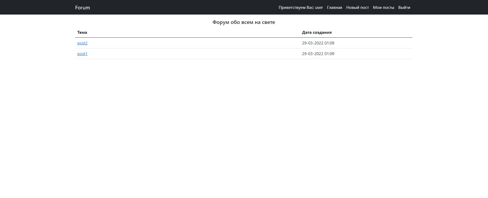
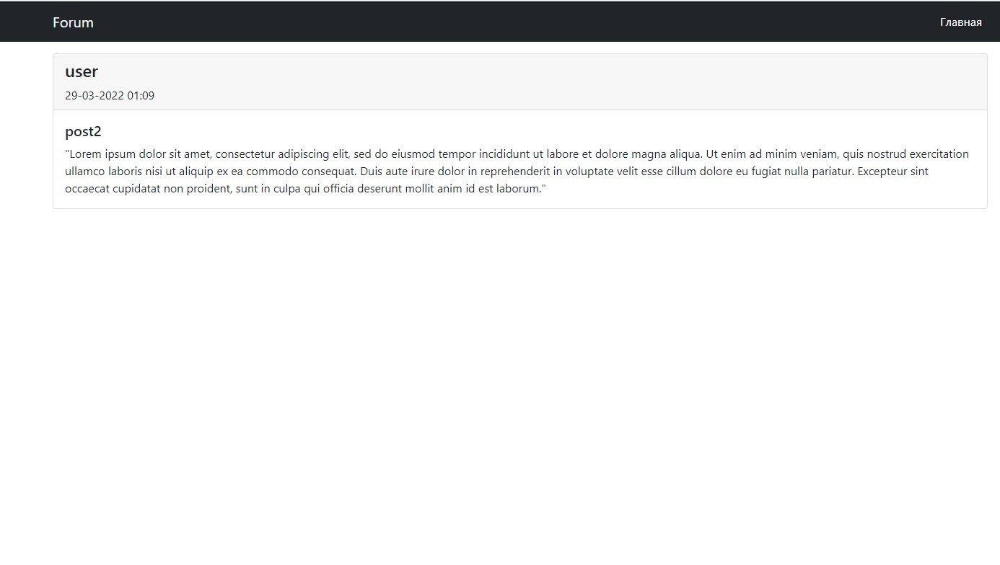
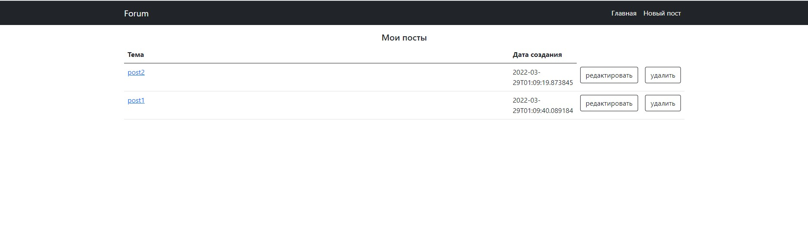
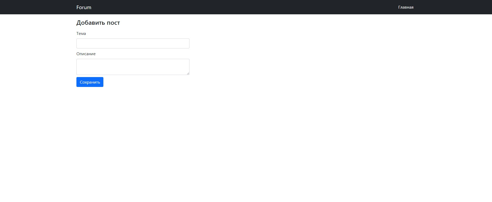
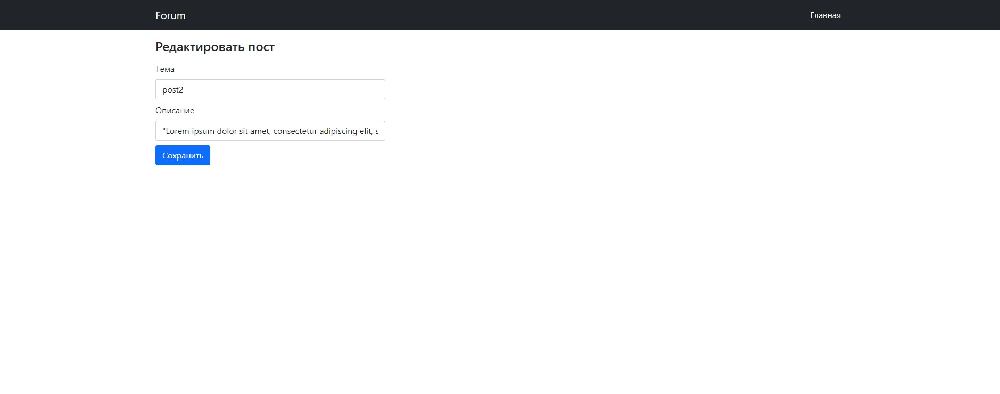
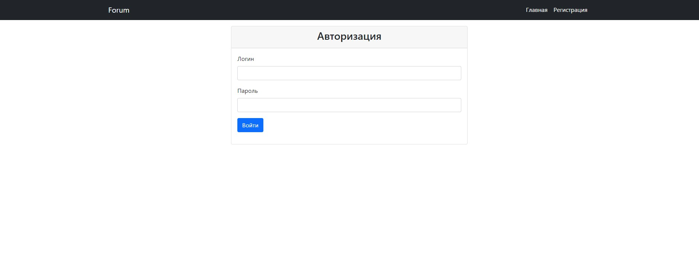
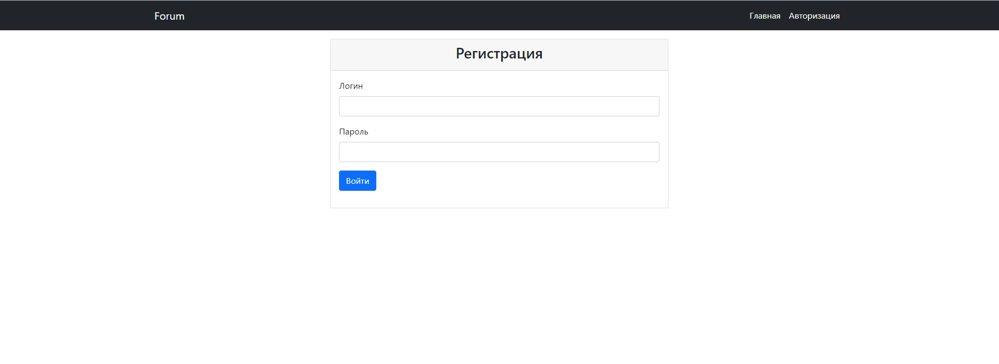

# Forum

Это приложение - классический форум в котором пользователи могут создавать свои посты. 

Для незарегестрированных пользователей доступно только чтение.

Зарегистрированные пользователи с ролью user могут создавать, а также редактировать и удалять свои посты

Пользователи с ролью admin могут создавать и редактировать посты всех пользователей.    
##### Технологии

- Java 15,
- Spring Boot(Data, Security, Test)
- PostgreSQL
- Maven
- Bootstrap 5
- Thymeleaf 

### Главная страница

Страница со списком всех постов.

Для зарегистрированного пользователя становятся доступны 2 дополнительные кнопки
новый пост и мои посты, для гостя эти кнопки скрыты.

### Страница пост 

Страница с текстом поста

### Список всех постов пользователя
Список всех постов пользователя с возможностью их удаления и редактирования.

 ### Создание нового поста
 

 ### Редактирование поста
 
 
 ### Страница авторизации
 

 ### Страница регистрации
 

 

